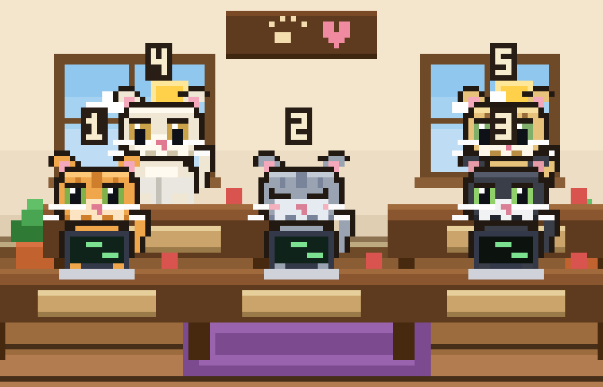

# 🐾 NEKO HQ (terminal) — Claude CLI kedi kafesi

Claude CLI (Claude Code) çalışırken her oturumu bir kedi olarak, **doğrudan
terminalde** (tarayıcı yok) sevimli bir piksel kafede gösterir. Soru sorunca /
araçlar çalışınca kediler yazar; sessizlikte uyurlar. İsim ve renk gibi
özelleştirmeler **arayüzden** yapılır 



Tek dosya, yalnızca Python standart kütüphanesi. **macOS / Linux / Warp** ve
truecolor destekli bir terminal gerekir.

---

## Hızlı indirme (GitHub)

> `ahmethasmerdogan` yerine kendi GitHub kullanıcı adını yaz.

```bash
curl -fsSLO https://raw.githubusercontent.com/ahmethasmerdogan/neko-hq/main/neko_tui.py
python3 neko_tui.py
```

ya da:

```bash
git clone https://github.com/ahmethasmerdogan/neko-hq.git
cd neko-hq
python3 neko_tui.py
```

## Kurulum & çalıştırma

İlk komut hook'ları kurar (Claude'un aktivitesini yakalamak için) ve kafeyi
terminalde açar:

```bash
python3 neko_tui.py
```

> Claude Code zaten açıksa, hook'ların yüklenmesi için bir kez yeniden başlat
> (ya da Claude içinde `/hooks` ile doğrula).

## Warp'ta kullanım

1. Warp'ta paneli böl.
2. Bir panede `python3 neko_tui.py`, diğerinde `claude`.
3. Soru sor / Claude çalışsın — kediler canlanır. Birden çok `claude` paneli
   açarsan her biri ayrı bir kedi olur.

> İpucu: pane'i biraz büyük tut (yaklaşık **112 sütun × 46 satır**). Daha küçük
> olursa görüntü taşabilir.

## Kontroller (arayüzden özelleştirme)

Alt satırda gösterilir:

| Tuş | İşlev |
|-----|-------|
| `1`–`8` | kediyi seç |
| `n` | seçili kediye **isim** ver (yaz + Enter, Esc iptal) |
| `c` | seçili kedinin **rengini** değiştir |
| `q` | çık |

İsim/renk seçimlerin `~/.neko-hq/cats.json`'a sessizce kaydedilir (elle
düzenlemen gerekmez); bir sonraki açılışta korunur.

## Nasıl çalışır

Claude Code'un **hooks** özelliği her olayda (prompt, araç öncesi, bitiş) küçük
bir komutla `~/.neko-hq/activity.log`'a `session_id` ile satır yazar. Terminal
uygulaması bu dosyayı doğrudan okur: her oturum bir kedi olur, son araç kedinin
pozunu belirler (yazma / okuma / terminal), hareket yoksa kedi uyur. Ekran
truecolor + yarım-blok (▀) karakterlerle çizilir — yani gerçek piksel grafik,
terminalin içinde.

## Hook komutları

```bash
python3 neko_tui.py --install-hooks     # sadece hook'ları kur
python3 neko_tui.py --uninstall-hooks   # hook'ları kaldır
python3 neko_tui.py --no-install        # hook kurmadan çalıştır
python3 neko_tui.py --demo              # sahte hareketle önizleme
```

## Sorun giderme

- **Kediler hep uyuyor / kedi yok:** hook'lar yüklü değil. `/hooks` ile bak,
  Claude Code'u yeniden başlat. Log'u izle: `tail -f ~/.neko-hq/activity.log`.
- **Renkler bozuk/kutucuklu:** terminal truecolor (24-bit renk) desteklemiyor.
  Warp destekler; bazı eski terminaller desteklemez.
- **Görüntü taşıyor:** pane'i büyüt ve monospace (sabit genişlikli) font kullan.
- **Windows:** bu sürüm macOS/Linux içindir (raw terminal girişi). WSL üzerinde
  çalışır.

## Gizlilik

Hiçbir sunucu/ağ yok; her şey terminalde. Log ve ayarlar bilgisayarında
(`~/.neko-hq/`) kalır.

## Kaldırma

```bash
python3 neko_tui.py --uninstall-hooks
rm -rf ~/.neko-hq
```

## Lisans

MIT — bkz. `LICENSE`. İlham: PixelHQ, pixel-agents, claude-office.
